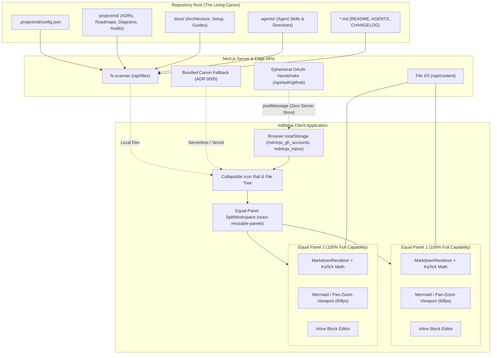
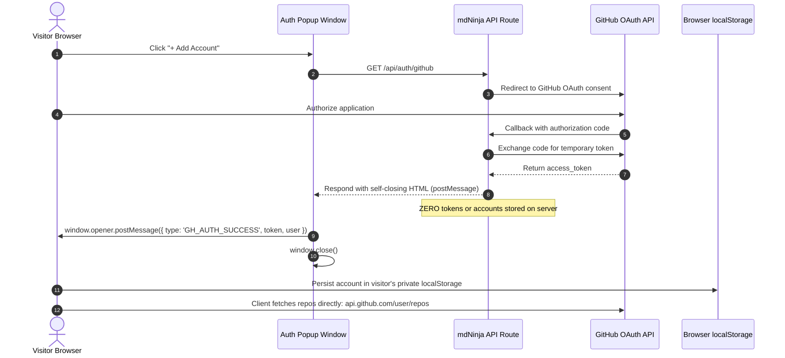

# System Architecture & Data Flow

```mermaid
graph TD
    subgraph RepoRoot ["Repository Root (The Living Canon)"]
        Config[".projectmd/config.json"]
        Canon["projectmd/ (ADRs, Roadmaps, Diagrams, Audits)"]
        Docs["docs/ (Architecture, Setup, Guides)"]
        Agents[".agents/ (Agent Skills & Directives)"]
        RootFiles["*.md (README, AGENTS, CHANGELOG)"]
    end

    subgraph CoreBackend ["Next.js Server & Edge APIs"]
        Scanner["fs-scanner (/api/files)"]
        BundledFallback["Bundled Canon Fallback (ADR 0005)"]
        IO["File I/O (/api/content)"]
        OAuth["Ephemeral OAuth Handshake (/api/auth/github)"]
    end

    subgraph Frontend ["mdNinja Client Application"]
        Sidebar["Collapsible Icon Rail & File Tree"]
        Splitter["Equal-Panel SplitWorkspace (react-resizable-panels)"]
        
        subgraph Panel1 ["Equal Panel 1 (100% Full Capability)"]
            Renderer1["MarkdownRenderer + KaTeX Math"]
            Diagram1["Mermaid / Pan-Zoom Viewport (60fps)"]
            Editor1["Inline Block Editor"]
        end

        subgraph Panel2 ["Equal Panel 2 (100% Full Capability)"]
            Renderer2["MarkdownRenderer + KaTeX Math"]
            Diagram2["Mermaid / Pan-Zoom Viewport (60fps)"]
            Editor2["Inline Block Editor"]
        end

        LocalStorage["Browser localStorage (mdninja_gh_accounts, mdninja_repos)"]
    end

    Config --> Scanner
    Canon --> Scanner
    Docs --> Scanner
    Agents --> Scanner
    RootFiles --> Scanner

    Scanner -.->|Local Dev| Sidebar
    BundledFallback -.->|Serverless / Vercel| Sidebar

    Sidebar --> Splitter
    Splitter --> Panel1
    Splitter --> Panel2

    IO --- Panel1
    IO --- Panel2

    OAuth -.->|"postMessage (Zero Server Store)"| LocalStorage
    LocalStorage --> Sidebar
```

---

## Zero-Leak Multi-User Isolation Flow

```mermaid
sequenceDiagram
    autonumber
    actor User as Visitor Browser
    participant Popup as Auth Popup Window
    participant Server as mdNinja API Route
    participant GitHub as GitHub OAuth API
    participant Storage as Browser localStorage

    User->>Popup: Click "+ Add Account"
    Popup->>Server: GET /api/auth/github
    Server->>GitHub: Redirect to GitHub OAuth consent
    User->>GitHub: Authorize application
    GitHub->>Server: Callback with authorization code
    Server->>GitHub: Exchange code for temporary token
    GitHub-->>Server: Return access_token
    Server-->>Popup: Respond with self-closing HTML (postMessage)
    Note over Server: ZERO tokens or accounts stored on server
    Popup->>User: window.opener.postMessage({ type: 'GH_AUTH_SUCCESS', token, user })
    Popup->>Popup: window.close()
    User->>Storage: Persist account in visitor's private localStorage
    User->>GitHub: Client fetches repos directly: api.github.com/user/repos
```
