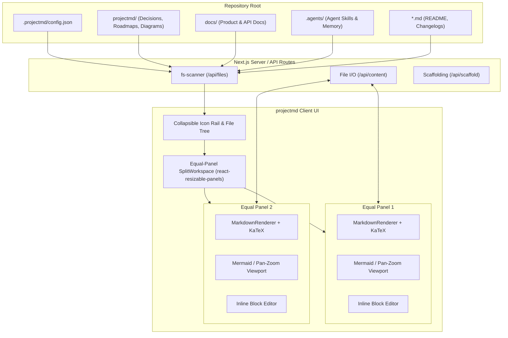

```mermaid
graph TD
    subgraph RepoRoot ["Repository Root"]
        Config[".projectmd/config.json"]
        Canon["projectmd/ (Decisions, Roadmaps, Diagrams)"]
        Docs["docs/ (Product & API Docs)"]
        Agents[".agents/ (Agent Skills & Memory)"]
        RootFiles["*.md (README, Changelogs)"]
    end

    subgraph CoreBackend ["Next.js Server / API Routes"]
        Scanner["fs-scanner (/api/files)"]
        IO["File I/O (/api/content)"]
        ScaffoldAPI["Scaffolding (/api/scaffold)"]
    end

    subgraph Frontend ["projectmd Client UI"]
        Sidebar["Collapsible Icon Rail & File Tree"]
        Splitter["Equal-Panel SplitWorkspace (react-resizable-panels)"]
        
        subgraph Panel1 ["Equal Panel 1"]
            Renderer1["MarkdownRenderer + KaTeX"]
            Diagram1["Mermaid / Pan-Zoom Viewport"]
            Editor1["Inline Block Editor"]
        end

        subgraph Panel2 ["Equal Panel 2"]
            Renderer2["MarkdownRenderer + KaTeX"]
            Diagram2["Mermaid / Pan-Zoom Viewport"]
            Editor2["Inline Block Editor"]
        end
    end

    Config --> Scanner
    Canon --> Scanner
    Docs --> Scanner
    Agents --> Scanner
    RootFiles --> Scanner

    Scanner --> Sidebar
    Sidebar --> Splitter
    Splitter --> Panel1
    Splitter --> Panel2

    IO <--> Panel1
    IO <--> Panel2
```
